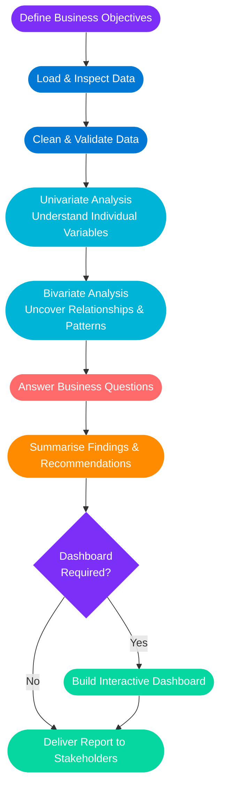

##  About Me

```python
analyst = {
    "name"          : "Aamir Devnath",
    "location"      : "South Africa",
    "focus"         : ["Data Analysis", "Cloud Engineering", "Business Intelligence"],
    "tools"         : ["Python", "SQL", "Power BI", "Azure", "Microsoft Fabric"],
    "certifications": ["Microsoft Azure", "IBM Data Analyst", "Google Analytics",
                       "MS Cloud Support Associate"],
    "currently"     : "Deepening Azure architecture knowledge",
    "goal"          : "Help organisations make smarter decisions with data"
}
```


## My Data Analysis Workflow

> Every project follows a structured, repeatable process — **business objectives first, always.**



### What each stage delivers

| Stage | What I do | Why it matters |
|:---|:---|:---|
| **Define Objectives** | Align with stakeholders on the core question | Ensures analysis stays focused and relevant |
| **Load & Inspect** | Profile datasets — shape, types & nulls | Surfaces data quality issues early |
| **Clean & Validate** | Handle missing values, outliers & inconsistencies | Guarantees trustworthy results |
| **Univariate Analysis** | Distributions, frequencies & summary stats | Builds understanding of each variable in isolation |
| **Bivariate Analysis** | Correlations, cross-tabs & comparative plots | Reveals relationships that drive business insight |
| **Answer Business Questions** | Apply analysis directly to the original objectives | Keeps output actionable, not just informative |
| **Summarise Findings** | Clear narrative with evidence-backed recommendations | Translates data into decisions stakeholders can act on |
| **Dashboard (if needed)** | Interactive visual layer for ongoing monitoring | Empowers teams to self-serve insights |


## Tech Stack

<p align="center">
  <a href="https://skillicons.dev">
    
  </a>
</p>

<p align="center">
  
  &nbsp;
  
  &nbsp;
  
  &nbsp;
  
  &nbsp;
  
</p>


## Certifications

<p align="center">
  
  &nbsp;
  
  <br/><br/>
  
  &nbsp;
  
</p>

## Let's Connect

<p align="center">
  <a href="#">
    
  </a>
  &nbsp;
  <a href="#">
    
  </a>
</p>


