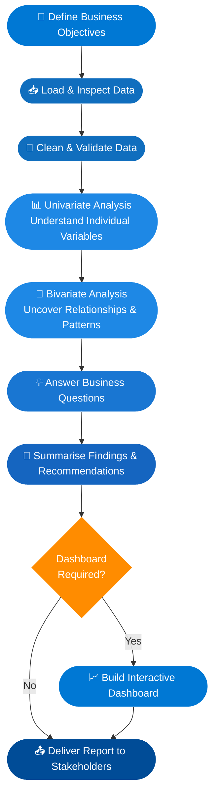

 

# Hi, I'm Aamir 👋
### Data Analyst | Cloud & BI Enthusiast | Microsoft Azure Certified

I turn raw data into decisions. My work sits at the intersection of **business analysis**, **cloud data engineering**, and **visual storytelling** — helping organisations move from questions to answers, faster.

---

## 🔁 My Data Analysis Workflow

Every project I take on follows a structured, repeatable process that keeps business objectives at the centre at every stage.

### What each stage delivers

| Stage | What I do | Why it matters |
|---|---|---|
| 🎯 Define Objectives | Align with stakeholders on the core question | Ensures analysis stays focused and relevant |
| 📥 Load & Inspect | Profile datasets, check shape, types & nulls | Surfaces data quality issues early |
| 🧹 Clean & Validate | Handle missing values, outliers & inconsistencies | Guarantees trustworthy results |
| 📊 Univariate Analysis | Distributions, frequencies & summary stats | Builds understanding of each variable in isolation |
| 🔗 Bivariate Analysis | Correlations, cross-tabs & comparative plots | Reveals relationships that drive business insight |
| 💡 Answer Business Questions | Apply analysis directly to the original objectives | Keeps output actionable, not just informative |
| 📝 Summarise Findings | Clear narrative with evidence-backed recommendations | Translates data into decisions stakeholders can act on |
| 📈 Dashboard (if needed) | Interactive visual layer for ongoing monitoring | Empowers teams to self-serve insights |

---

## 🛠️ Tech Stack

---

## 🏅 Certifications

- **Microsoft Certified** – Azure & Cloud fundamentals
- **IBM Data Analyst Professional Certificate**
- **Google Data Analytics Certificate**
- **Microsoft Cloud Support Associate Professional Certificate**

---

## 📌 Featured Projects

| Project | Description | Tools |
|---|---|---|
| [Complete Microsoft Fabric Project](#) | End-to-end data pipeline from ingestion to BI reporting | Microsoft Fabric, Power BI |
| [Customer Segmentation & Market Analysis](#) | Clustering and segment profiling for business strategy | Python, Pandas, Scikit-learn |
| [Bike Store End-to-End Analysis](#) | Full analysis pipeline from raw sales data to executive dashboard | SQL, Python, Power BI |

---

## 📫 Let's connect

